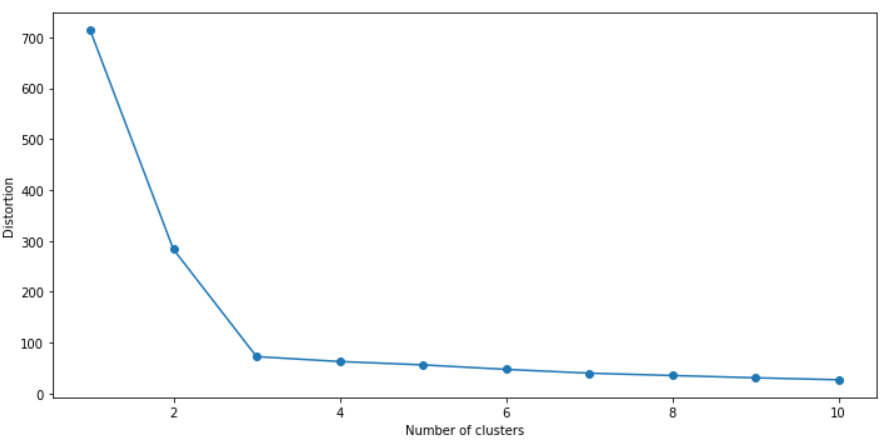
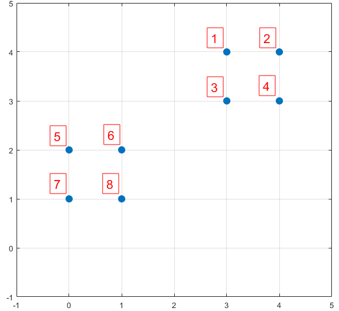
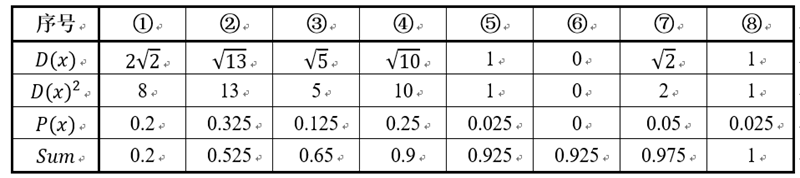
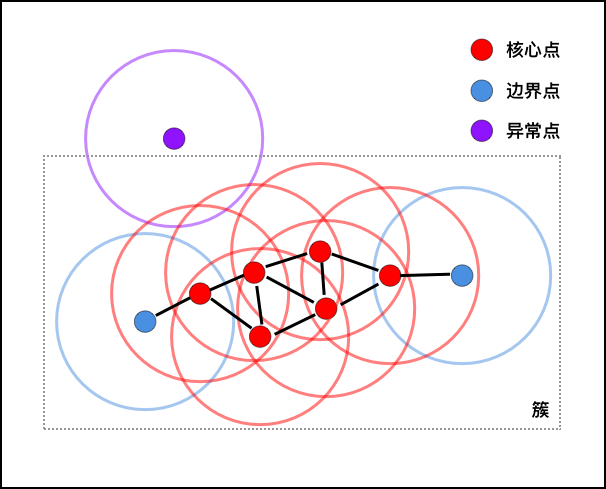
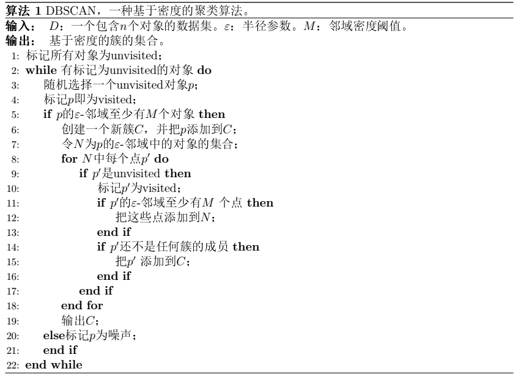

# 聚类分析

## 前言

**聚类**是一种无监督的学习，聚类是指根据相似数据点的属性或特征将它们分组在一起，（物以类聚，人以群分）

- 抽象性例子：
  - 汽车的品牌：宝马、奔驰、特斯拉、五菱宏光等

- 数值性例子：

  - 如果我们有一组人的收入和支出，我们可以将他们分为以下几类：

    - 高收入，高消费

    - 高收入，低消费
    - 低收入，低消费
    - 低收入，高消费

**聚类与分类的区别**：聚类与分类的最大不同在于，分类的目标事先已知，而聚类则不一样。因为其产生的结果与分类相同，而只是别设有预先定义，聚类有时也被称为无监督分类

**应用方向：**

- 划分客户：高端客户、白领、学生等
- 社交网络：朋友圈
- 图像分割

**典型算法：**

- K-Means
- DBSCAN
- GMM
- 凝聚层次聚类

注意事项：聚类时，请勿随意标准化或者压缩特征

## 1. k-均值

### 1.1 算法思想

k-Means 算法的主要思想是通过不断迭代确定 k 个集群的中心，将样本数据分配到离其最近的集群中心

步骤：

1. 随机从样本中挑选 k 个样本作为初始聚类中心

2. 计算所有样本点到每个聚类中心的距离，并将每个样本分配到最近的聚类中心

3. 求每个集群的平均值
4. 调整聚类中心到每个群体的平均值位置
5. 重复步骤 1，2 和 3，直到集群的聚类中心不变或者达到用户定义的容限或最大迭代数

### 1.2 用和方差 SEE 评估聚类效果

公式：

- $\mu_i^{(j)}$：表示第 $j$ 个聚类中心

- $x^{i}$：表示第 $i$ 个样本数据，如果第 $i$ 个样本属于第 $j$ 类，则 $w^{(i,\; j)}=1$，否则 $w^{(i,\; j)}=0$

$$
SSE=\sum_{i=1}^n\sum^k_{j=1}w^{(i,\; j)}||x^{i}-\mu^{j}||^2_2
$$

SSE 值越小，表示数据点越接近于它们的质心，聚类效果也越好

### 1.3 算法实现

**API** 

```python
sklearn.cluster.KMeans(n_clusters=8, 
                       *, 
                       init='k-means++', 
                       n_init=10, 
                       max_iter=300, 
                       tol=0.0001,
                       precompute_distances='deprecated', 
                       verbose=0, 
                       random_state=None, 
                       copy_x=True, 
                       n_jobs='deprecated', 
                       algorithm='auto'
                      )
```

### 1.4 算法分析

**优点：**

- 原理简单，速度快

**缺点：**

- 受离群点影响较大

- 需要指定聚类数量 K
- 对初始聚类中心值敏感，容易陷入局部最优
  - 解决办法：
    - 多次独立运行，每次计算随机选用不同的中心，选择最小化群内误差平方和（SSE）最低的为最终模型
    - 采用 K-means++算法
- 只能发现球型类簇（假设数据成球型

### 1.5 “肘部”法确定聚类个数

因为 K-mens 算法中必须需要人为指定的聚类的个数，但是在很多场景或模型，我们一般是没办法直接确定聚类的个数

SSE 值越小，说明每组的成员数据之间距离越近。随着 K 值的增加，SSE 也会越来越小，但是 K 值又不能无限大（因为会失去聚类的意义），所以我们需要找到 SSE 一个比较合适拐点，即可确定聚类个数

可以釆用肘部观察法大致确定 K 值

**代码实现**

```python
from sklearn.datasets import make_blobs
import matplotlib.pyplot as plt
from sklearn.cluster import KMeans


X, y = make_blobs(n_samples=150,
                  n_features=2,
                  centers=3,
                  cluster_std=0.5,
                  shuffle=True,
                  random_state=0)

distortions = [] 
for i in range(1, 11):
    km = KMeans(n_clusters=i,
                init="k-means++",
                n_init=10,
                max_iter=300,
                 random_state=0)
    km.fit(X)

	# 平方误差 SSE
    distortions.append(km.inertia_)

plt.plot(range(1,11), distortions, marker='o')
plt.xlabel('Number of clusters')
plt.ylabel('Distortion')
plt.tight_layout()
plt.show()
```



## 2 K-均值++

为了解决使用随机种子设置初始值中心的经典k-均值算法，有时如果初始聚类中心选择不当，会导致聚类不良或收敛缓慢的问题，可以采用 K 均值++ 

### 2.1 算法思想

K-means++ 主要是为了在初始化 K 个初始聚类中心时，使得这 K 个初始聚类中心离得尽可能地远，然后再采用经典 K-means 算法进行聚类

### 2.2 算法步骤

1. 初始化聚类中心 C 为空集
2. 从数据集中随机选取一个样本，加入初始聚类中心集 C
3. 计算数据集中每个样本与当前初始聚类中心集 C 的最知距离 $D(x)$（即与最近的一个聚类中心的距离）
4. 计算每个样本被选为下一个初始聚类中心的概率 $P(x)=\frac{D(x)^2}{\sum_{x \in X}D(x)^2}$，最后采用轮盘法选择出下一个聚类的概率
5. 重复 3-4 步，直到选择出 k 个初始聚类中心，再采用经典的 K-means 聚类算法

例如：

数据集中共有8个样本，分布以及对应序号如下图所示：



假设随机选择了 6 号点为第一个初始聚类中心

计算每个样本到聚类集的最短距离和概率如下：



随机产生出一个 0~1 之间的随机数，判断它属于哪个区间，那么该区间对应的序号就是被选择出来的第二个聚类中心了。例如 1 号点的区间为 $[0,\; 0.2)$，2 号点的区间为 $[0.2, \; 0.525)$，8 号点的区间为 $[0.975, \; 1]$

### 2.3 算法实现

`sklearn.cluster.KMeans` 这个类对于初始聚类中心的选择默认就是 k-means ++

### 2.4 轮廓图评估聚类效果

如果被用于评估的数据没有所属类别，我们使用轮廓系数(Silhouette Coefficient)来度量聚类结果的质量。

轮廓系数同时兼顾了聚类的凝聚度(Cohesion)和分离度(Separation)，用于评估聚类的效果并且取值范围为 $[1,1]$

轮廓系数数值越大，表示聚类效果越好。计算步骤如下：

1. 计算集群凝聚度 $a^{i}$

   即样本 $x^{(i)}$ 与同一集群所有其他样本距离的平均值

2. 计算集群与其他最近集群的分离度 $b^{(i)}$

   即样本 $x^{(i)}$ 与其他最近集群内所有样本距离的平均

3. 计算轮廓系数 $s^{(i)}$

   即集群内聚度与集群分离度之差，除以两者中较大的那一个

$$
s^{(i)}=\frac{b^{(i)}-a^{(i)}}{\operatorname{Max}\left(b^{(i)}, \ a^{(i)}\right)}=\left\{\begin{array}{ll}
1-\frac{a^{(i)}}{b^{n}} & , a^{(i)}<b^{(i)} \\
0 & , a^{(i)}=b^{(i)} \\
\frac{b^{(i)}}{a^{(i)}}-1  & , a^{(i)}>b^{(i)}
\end{array}\right.
$$

- 轮廓系数范围在 $[-1，1]$ 之间，该值越大，越合理

- $s^{(i)}$接近 $1$，则说明样本 $i$ 聚类合理
- $s^{(i)}$接近 $-1$，则说明样本更应该分类到另外的簇
- 若 $s^{(i)}$ 近似为 $0$，则说明样本 $i$在两个簇的边界上

#### 代码实现

```python
import numpy as np
def my_silhouette(X, y_km):
    
    cluster_labels = np.unique(y_km)
    
    from scipy.spatial.distance import pdist, squareform
    
    # 计算两两的平方欧式距离
    sq_dists = pdist(X, 'euclidean')
    
    # 将成对的距离转换成一个方阵
    mat_sq_dists = squareform(sq_dists)
    
    
    silhouette_vals = np.zeros(X.shape[0])
    
    for i in range(X.shape[0]):
        # 样本 i 的其他样本距离，按集群划分
        dists = []
        for label in cluster_labels:
            dists.append(mat_sq_dists[i, y_km==label])
            
        # 集群内凝聚度 
        a = dists[y_km[i]].sum()/(dists[y_km[i]].shape[0]-1)
        
        # 到其他集群的平均距离
        b = [dists[j].mean() for j in range(len(dists)) if j != y_km[i]]
        
        # 取最近的集群的平均距离
        b = min(b)
        
        # 轮廓系数
        sc = (b-a)/max(b,a)
        
        silhouette_vals[i] = sc

    return silhouette_vals
    
# sklearn 实现
from sklearn.metrics import silhouette_samples
    
sc1 = my_silhouette(X, y)
sc2 = silhouette_samples(X, y, metric='euclidean')
print([int(i) for i in sc1-sc2])
```

## 3 DBSCAN 算法

基于密度的带有噪声点的聚类方法 (Density-Based Spatial Clustering of Applications with Noise, DBSCAN)，DBSCAN 的聚类的每个分组没有绝对的中心点，并且每个样本都可以成为其他样本的核心以扩展自己的分组

### 3.1 算法思想

DBSCAN 算法的思想跟传染病传播有些相似之处，只是它传播的条件有些特别。

在距离被感染病毒的人 R 的范围内，如果有 k 个人（包含已经被感染病毒的人）存在，那么这 k 人都会被感染病毒，并且他们可以进行向其他人按同样的传染条件，传染病毒给其他人。



### 3.2 算法步骤

#### 基本概念

**$\epsilon$ 邻域：**对任意一个点p, 其 $\epsilon$ 邻域定义为： $N_{\epsilon}(p)=\{q \in D \mid d i s t(p, q) \leq \epsilon\}$ 

**密度：**设 $x \in X,$ 则 $\rho(x)=\left|N_{\epsilon}(x)\right|$ 为 $x$ 的密度。

**核心点：**设 $x \in X,$ 若 $\rho(x) \geq M i n P t s$， 则称 $x$ 为 $X$ 中的中心点，中心点构成的集合为 $X_{c }$

**边界点：**设 $x \in X \backslash X_{c}$ ，且 $x$ 落在某个核心点的 $\epsilon$ 邻域内。一个边界点可能落在多个核心点的 $\epsilon$ 邻域内。 

**直接密度可达:** 设 $x, y \in X$， 若满足 $y \in N_{\epsilon}(q)$ 且 $\left|N_{\epsilon}(q)\right| \geq M i n P t s,$ 则称 $y$ 从 $x$ 直接密度可达。 

**密度可达：**假设存在一串点 $p_{1}, p_{2}, \ldots, p_n, p_{1}=q, p_{n}=p$， 使得 $p_{i+1}$ 从 $p_{i}$ 是直接密度可达的, 那么就认为 $p$ 从 $q$ 密度可达。 

**密度相连：**假设存在点 $o, p, q$， 其中 $p, q$ 均从 $o$ 密度可达, 那么 $p$ 和 $q$ 密度相连。密度相连具有对称性。 

类簇：设非空集合 $C \subset X,$ 若满足: $\forall p, q$,
(1) $p \in C$, 且 $q$ 从 $p$ 密度可达, 那么 $q \in C$ 
(2) $p$ 和 $q$ 密度相连

则称 $C$ 构成一个类簇。



### 3.3 算法实现

**API**

```python
sklearn.cluster.DBSCAN(
    eps=0.5, 
    min_samples=5, 
    metric='euclidean', 
    metric_params=None, 
    algorithm='auto', 
    leaf_size=30, 
    p=None, 
    n_jobs=None
)
```

参数介绍：

1. [sklearn](https://scikit-learn.org/0.20/modules/generated/sklearn.cluster.DBSCAN.html)
2. [博客](https://www.cnblogs.com/pinard/p/6217852.html)

### 3.4 算法分析

**优点：**

- 可以对任意形状的稠密数据集进行聚类，相对的，K-Means之类的聚类算法一般只适用于凸数据集

- 可以在聚类的同时发现异常点（离群点），对数据集中的异常点不敏感

- 对初始值没影响，K-Means初始值对聚类结果有很大影响
- 不需要设置集群个数

**缺点：**

- 如果样本集的密度不均匀、聚类间距差相差很大时，用 DBSCAN 聚类一般不适合。
- 如果样本集较大时，计算量大，收敛慢，需要降维处理
- 参数对模型影响很大，调参有大的难度

