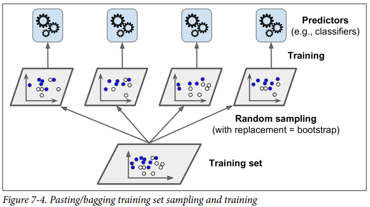
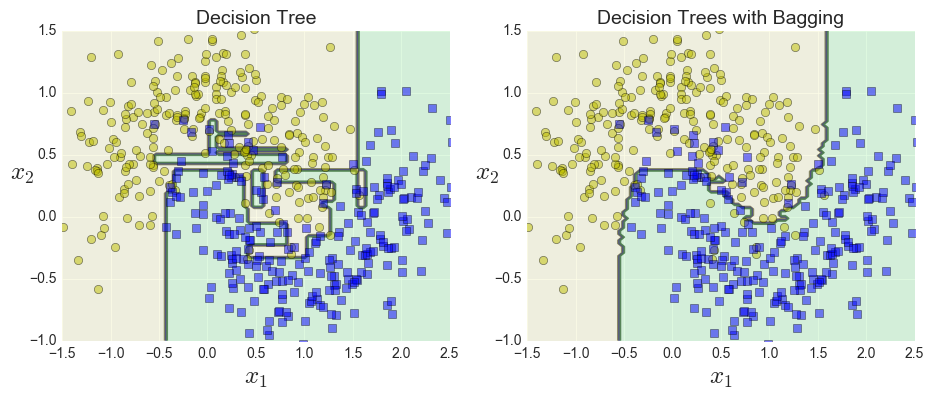
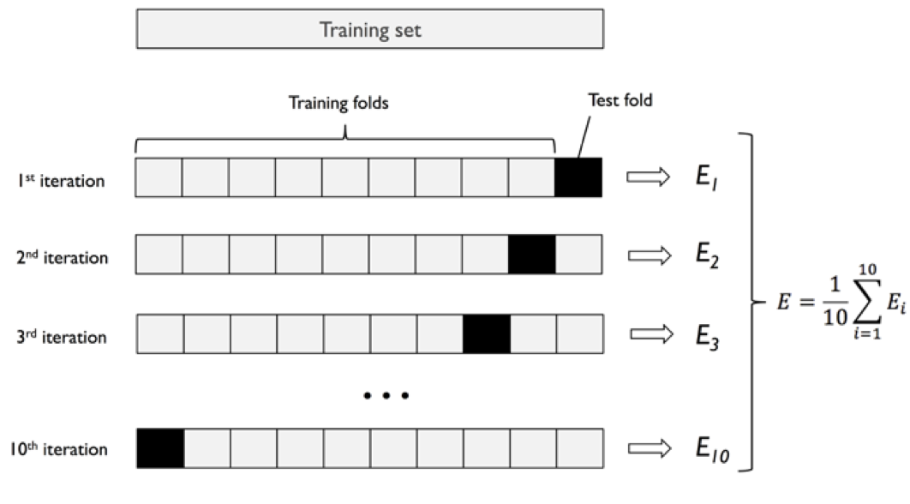
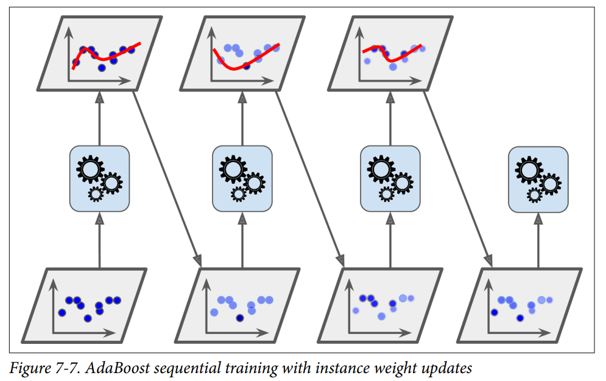
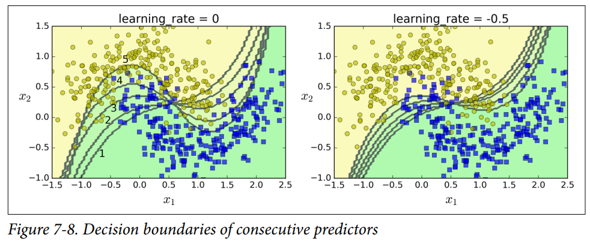
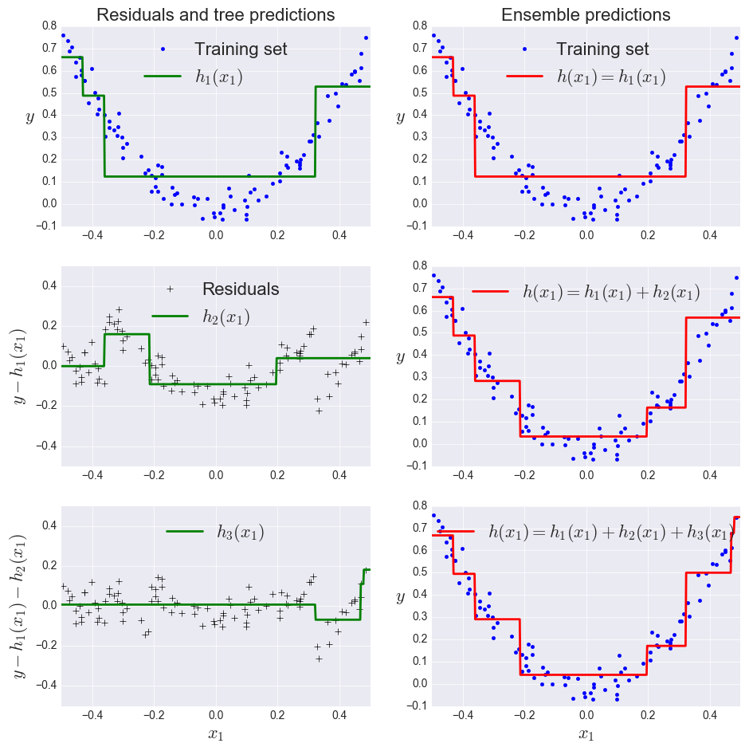

## 概要

- Bagging + Decicion Trees = Random Forest
- Extremely Random + Random Forest = Extremely Randomized Trees(Extra Tree)
- Ada Boost + Decicion Trees = Boosting trees
- Gradient Boosting + Decicion Trees = GBDT
- Optimized Implementation of Gradient Boosting = XGBoost
- K-fold Cross-validation + Grid Search= Effective Way to optimize Models
- Employ **Otto dataset** to train some of the models mentioned above

## Random Forest

### Bagging

#### 算法过程

1. 从原始样本集中使用 Bootstraping 方法随机抽取 n 个训练样本，共进行 k 轮抽取，得到 k 个训练集
   （k 个训练集之间相互独立，元素可以有重复，这叫有替换釆样）
2. 对于 k 个训练集，训练 k 个模型（这 k 个模型可以根据具体问题而定，比如决策树，KNN 等）
   - 对于分类问题：由投票表决产生分类结果
   - 对于回归问题：由 k 个模型预测结果的均值作为最后预测结果（所有模型的权值相同）



#### 优点：

1. 与单个预测器相比，拥有更低的方差，抗过拟合风险的能力更强

2. 支持并行运算，训练过程可同时在多个 CPU 核或多个服务器上进行

#### Out-of-Bag Evaluation

- 使用套袋方法时，算法每次默认选取 63% 的训练样本进行训练其中的一个预测器
- 剩下的 37% 可以用来做验证集，每次训练完后自动喂入预测器，得到验证准确率

```python
bag_clf = BaggingClassifier(
     DecisionTreeClassifier(),
     n_estimators=500, 			
     bootstrap=True, n_jobs=-1, oob_score=True)

>>> bag_clf.fit(xtrain, ytrain)
>>> bag_clf.oob_score_
```

### 构建过程

1. 在原始训练集中使用 Bootstraping 方法随机**有替换采样**出 m 个样本，共进行 `n_tree` 次采样，生成 `n_tree` 个训练集
2. 对于 `n_tree` 个训练集，我们分别训练 `n_tree` 个决策树模型
3. 对于单个决策树模型，假设训练样本特征的个数为 n，那么每次分裂时根据信息增益 / 信息增益比 / 基尼系数选择最好的特征以及最好的特征分割阈值进行分裂
4. 每棵树都一直这样分裂下去，直到该节点的所有训练样例都属于同一类。在分裂过程中不需要剪枝
5. 将生成的多棵决策树组成随机森林。对于分类问题，按多数投票机制确定最终分类结果；对于回归问题，将多棵树预测回归值的均值作为最终预测结果

#### 优点

- 具有极高的准确率
- 引入随机性，多样性，与单棵决策树相比，不易过拟合



- 随机性的引入，使得随机森林有很好的抗噪声能力

- 能处理很高维度的数据，并且不用做特征选择
- 既能处理离散型数据，也能处理连续型数据，数据集无需规范化
- 训练速度快
- 容易实现并行化

#### 缺点

- 当随机森林中的决策树个数很多时，训练时需要的空间和时间会较大

- 单棵决策树可以可视化，是个白盒模型，可解释性强，但多棵决策树组成的随机森林模型有许多不好解释的地方，算是个黑盒模型

## Extra Trees

Extra Tree (Extremely Randomized Trees) 是随机森林的—个变种，原理基本和随机森林一样，主要是有如下区别：

1. 随机森林使用随机采样来作为子决策树的训陈练集，而 Extra Tree 每个子决策树采用原始数据集训练
2. 随机森林在选择划分特征点的时候会和传统决策树一样，在每个分裂节点中会通过计算寻找最优分割阈值作为特征值的分割标准；Extra Trees 则不会计算最优阈值，而是对每一个特征，在其特征取值范围之内随机生成一个分割阈值，然后通过计算判断是否选择该分割阈值作为分割标准。

由于 Extra Trees 是随机选择特征点进行划分，所以最后得到的决策树规模会大于随机森林生成的决策树的规模。Extra Trees 决策树的方差会减少，泛化能力比随机森林更强。具体表现还是要根据测试结果分析。

## 模型训练过程中的一些评估指标及方法

#### log 损失

1. 对于多分类问题：$-\sum_i^N\sum^M_jy_{ij}log(p_{ij})$

- 其中 $N$ 是输入的样本数或者实例的数量，$i$ 是某一个样本或者实例
- $M$ 表示样本可能的分类数量，$j$ 表示某一个分类
- $y_{ij}$ 表示某个样本 $ⅰ$属于分类 $j$  的标签（通常是 $0$ 或者$1$ ），$i$ 只属于一个分类
- $p_{ij}$ 表示样本 $i$ 预测为分类 $j$ 的概率。

$log \ loss $旨在惩罚错误分类，对于完全正确的分类（预测概率 $p$ 为 $ 1$），显然其对 $loss$ 的贡献为 $ 0$，可以控制其范围避免因为 $0$ 或者 $1$ 带来的 $ log$ 溢出问题。运用 $log \ loss$的典型分类器是 $Logistic$ 回归算2. 对于二分类问题：$-\sum_i^N(y_ilogp_i+(1-y)log(1-p_i))$

#### k折交叉验证

- 无替换的重新采样技术
- 每个采样点仅用于一次验证，其他采样点做训练
- 对多次验证结果求均值，得到的综合验证结果更加可靠



#### 网格搜索

- 用于找出使得模型拟合效果最佳的超参数组合
- 配合 k 折交叉验证，两者结合使用，是模型性能调优的有效方法

## Boosting

### 基本思路

- 对于训练集中的每个样本建立权值 $w$，表示对每个样本的关注度。当某个样本在当前分类器被误分类的概率很高时，需要加大该样本在下一个分类器中的权值
- 进行训练迭代的过程中，每一次迭代都产生一个弱分类器，boosting 技术（有多种具体方法）用某种策略将它们组合，作为最终模型。

### Ada Boost

#### 算法思路

1. First trains a base classifier(such as a Decision Tree)and uses it to make predictions on the training set
2. Then increases the relative weight of misclassified training instances
3. Then it trains a second classifier, using the updated weights, and again makes predictions on the training set, updates the instance weights, and so on



#### 直观效果展示



#### 算法具体步骤

1. Weighted error rate of the  $j^{th}$  predictor (Each instance weight $w^{(i)}$) is initially set to 1/m)
$$
  r_{j}=\frac{\sum_{i=1 \\ \hat{y}_j^{i} \neq y^{(i)}}^{m} w^{(i)}}{\sum_{i=1}^{m} w^{(i)}}
$$

2. Calculate predictor weights
$$
\alpha_{j}=\eta \log \frac{1-r_{j}}{r_{j}}
$$

3. Updates the instance weights

$$
  w^{(i)} \leftarrow\left\{\begin{array}{ll}
  w^{(i)} & \text { if } \widehat{y}_{j}^{(i)}=y^{(i)} \\
  w^{(i)} \exp \left(\alpha_{j}\right) & \text { if } \widehat{y}_{j}^{(i)} \neq y^{(i)}
  \end{array}\right.
$$
4. Calculate AdaBoost predictions, and make the final decision. 

$$
\begin{aligned}
&\\
&\hat{y}(\mathbf{x})=\underset{k}{\operatorname{argmax}} \sum_{j=1 \atop \hat{y}_{j}(\mathbf{x})=k}^{N} \alpha_{j}
\end{aligned}
$$

## Gradient Boosting

### 基本原理介绍



### XGBoost

- 目前被广泛应用的一种 Boosting 模型，效果很好

- 以 Gradient Boosting为主基础，进行细节上的深度优化